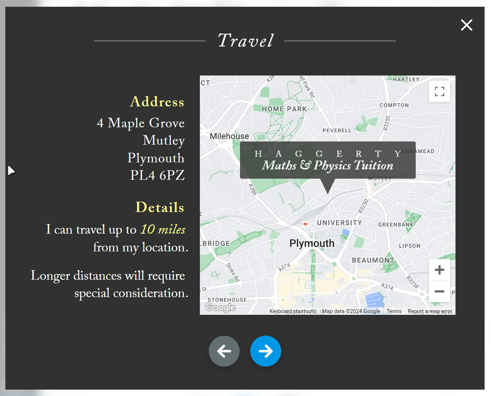
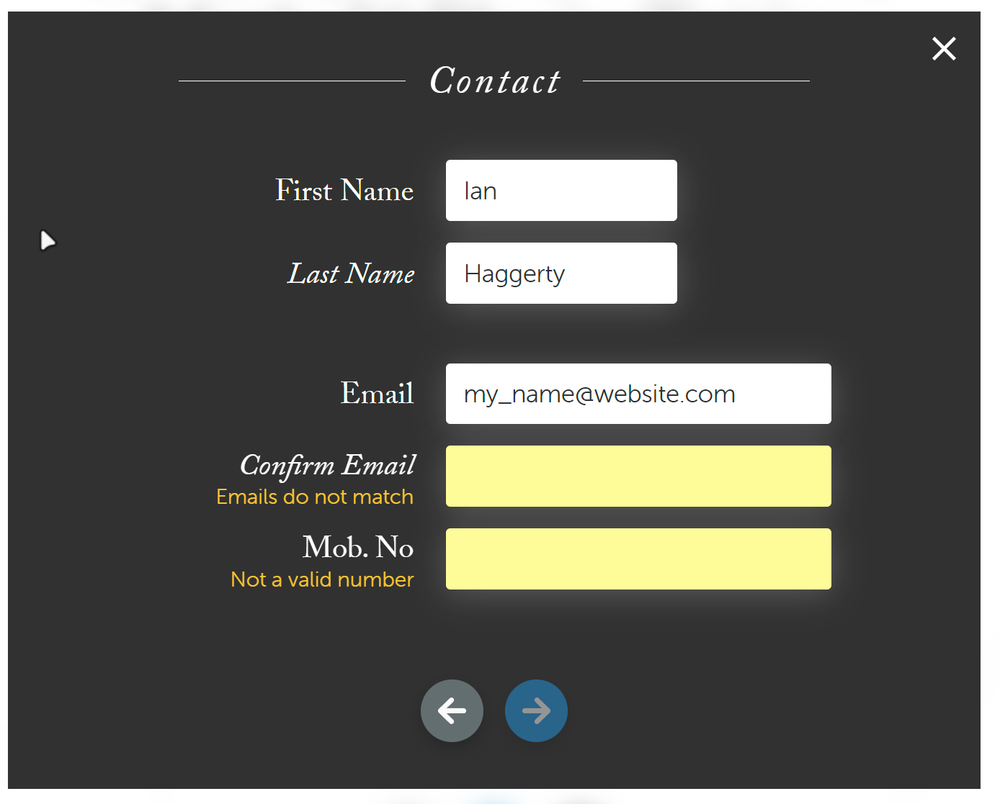
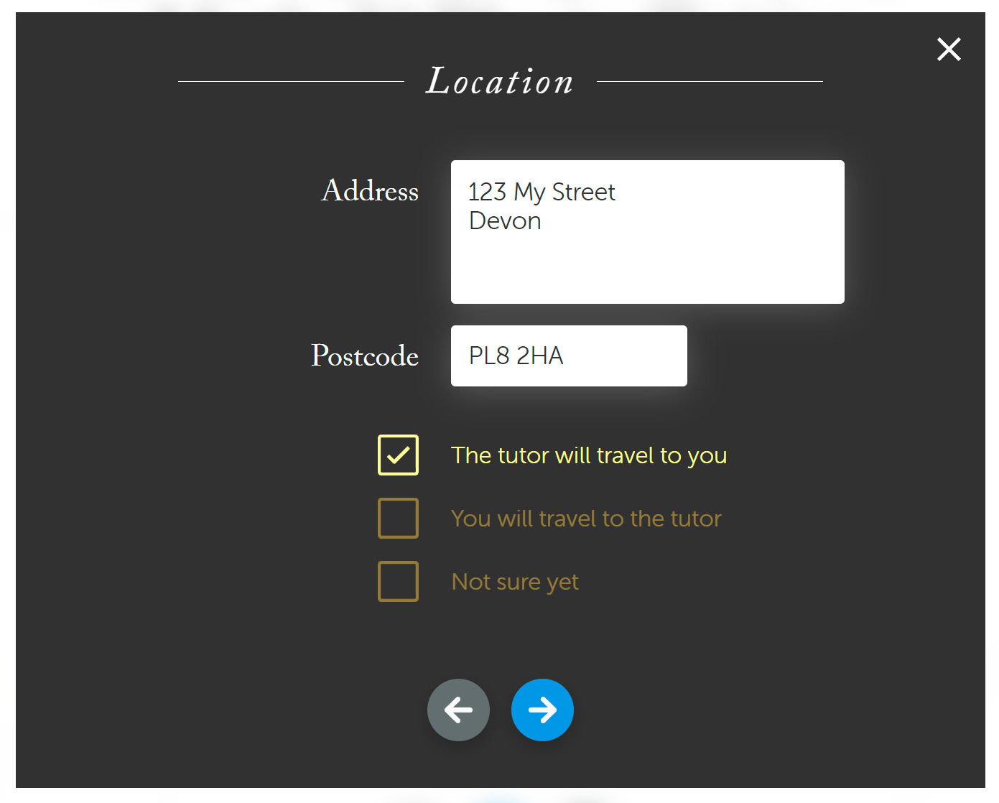
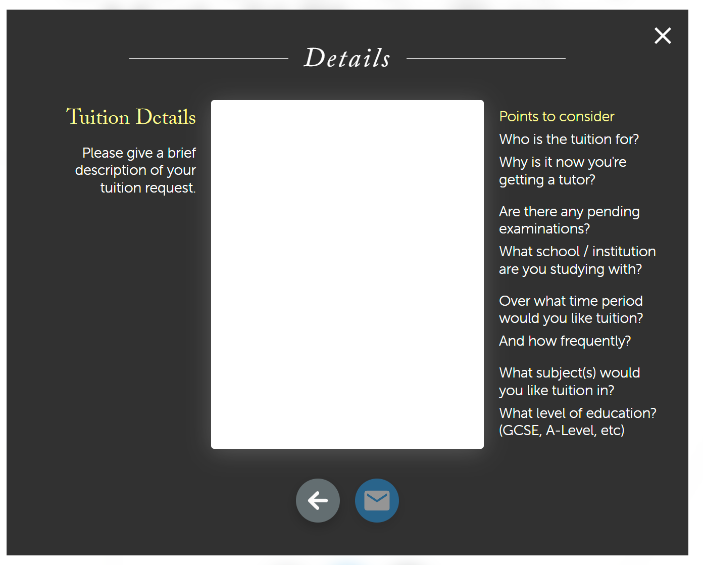

### Haggerty Tuition

This is my own personal tuition website! It is a work in progress. I have temporarily open-sourced for the purpose of job applications.

### Images

### Core Technologies

## A Note from the Author

Thanks for your interest! Please see my [GitHub](https://github.com/ianhaggerty) or [Linkedin](https://www.linkedin.com/in/ihaggerty/) to stay updated.
